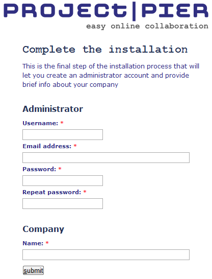
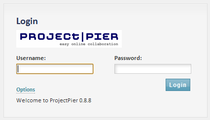

# Configure ProjectPier

## Overview
> Note: these instructions are specific to ProjectPier version 0.8.8 with SP2 (Service Pack 2) installed. For installation instructions refer to the [installation section](INSTALL.md) of the manual.

The purpose of this document is to help you configure a new instance of ProjectPier after it has been installed.

## Creating User Accounts
### Administrator Account

After your new instance of ProjectPier has been installed it is almost ready to use, but first you need to create user accounts. 
A minimum of one user account must be created, this is the **administrator account**. To create the administrator account, access the URL of your new installation (for this documentation we will use the example URL of ```http://www.example.com/projects/``` where *"projects"* represents the directory where you have installed ProjectPier). 

> We recommend the administrator be someone within your organization who is tech savvy enough to understand the concepts of user roles and login based permissions. 

Within ProjectPier each user is given their own user account. This will be a unique username and password the user will enter to gain access to your installation of ProjectPier. The screen for creating the administrator account will be shown automatically after the final setup screen, a screenshot is shown in Figure 1.

**Figure 1**


To complete the installation of ProjectPier provide the information required on this form:
- Username
- Email address
- Password (twice)
- Company name.

> NOTE: THE ADMINISTRATOR ACCOUNT IS A SPECIAL ACCOUNT AND SHOULD NEVER BE DELETED!

> NOTE: DO NOT LOSE YOUR ADMINISTRATOR USERNAME AND PASSWORD. IF YOU DO FORGET YOUR PASSWORD THERE IS A PASSWORD RECOVERY OPTION ON THE LOGIN SCREEN UNDER THE “OPTIONS” LINK, BUT IT REQUIRES YOU TO KNOW THE EMAIL ADDRESS THAT WAS USED TO CREATE THE ACCOUNT.

After the administrator account has been created, ProjectPier will display the login prompt. 
The administrator creation page will never be shown again! Any future visits to the URL of your ProjectPier installation will display the login prompt (unless a user has opted to save their credentials so they are automatically logged in). 
A screenshot of the login screen is shown in figure 2 below.

**Figure 2**


Use the login screen to login to your ProjectPier installation using the administrator username and password created in the previous steps.

### Accounts For Your Staff

ProjectPier is designed such that each member of your project team will have a unique user account with a unique username and password. 
If your project team includes multiple companies (partners, customers, vendors, subcontractors, etc.), ProjectPier is designed to handle that. 
If you intend to create users other than the administrator account then continue following the steps in this section, if not jump to [Setting User Permissions](#setting-user-permissions).

> NOTE THAT EVEN THE ADMINISTRATOR ACCOUNT REQUIRES PERMISSION CHANGES BEFORE ALL THE FEATURES OF PROJECTPIER BECOME AVAILABLE.

Before creating user accounts for the staff at your company or organization, first update the information about your company. In particular, set the time zone in which most of your employees operate. To do this, select “Administration, Edit Company” from the main menu. 
  > Note, the main menu is the menu located at the top of the page.

Fill in additional information such as the phone and mailing address. Be sure to click the button “Edit Company” at the bottom of the page to save changes.

Creating a user account for a staff member is a two-step process. 

- The person must be added as a “contact”
- And then upgraded from a “contact” to a “user”. 
  > - A “contact” is a person for whom you want to keep contact information
  > - A “user” is a person whom you want to grant access your ProjectPier installation. 

To take the first step, locate the main menu and select “Administration, Add Contact”. 
Fill in the form as completely as possible; ensure that at minimum all the required fields have been completed. Required fields are denoted with an asterisk (*). Select the “Add contact” button at the bottom of the page to add the person as a contact. 
> The Contact Detail page is now shown which shows all the details you entered related to the new contact. 

Next we need to “Add User” which can be done from the Contact Detail page by selecting the drop-down menu  and selecting “Add User”. 
On the “Add User” page enter all the required fields.

> NOTE: DO NOT SELECT ANY CHECKBOXES UNDER THE “PERMISSIONS” SECTION AT THE BOTTOM OF THE PAGE! (SEE BUG #3232)

### Accounts For People That Are No Part Of Your Company

ProjectPier is designed such that each member of your project team will have a unique user account with a unique username and password. If your project team includes multiple companies (partners, customers, vendors, subcontractors, etc.), ProjectPier is designed to handle that. 
> Note that the terminology in ProjectPier is “Company”; which refers to your organization and “Clients” which refers to any company or organization outside of your own.

There are two ways to approach adding accounts for people from other companies or organizations. 
The first way is to create the new organization and then create contacts that belong to that organization. 
The second way is to create a new contact and while on the “Edit Contact” screen under the heading “Company”, select “New Company” and enter the company name. 
> The second option is faster but does not allow you to enter all the information associated with the new company.

To take the second approach, select “Administration, Add Client” from the main menu. The “Add Client” page is now shown. Fill in the information you want to keep on record. Be sure to click the button “Add Client” at the bottom of the page to save changes.

Whether the new company was added through the first or second method as described above, the new company name will be available in the Company drop-down menu when adding any additional new contacts.

## Setting User Permissions

In ProjectPier the administrator does not have access to all the functionality by default, so it is important to set user permissions. For example, the administrator cannot create a new project until permission to do so has been granted by the administrator herself/himself. Note that for each user there are global permissions as well as project level permissions. These different types of permissions are accessed in two different locations.

Begin by setting the administrator’s global permissions. From the main menu select “Administration, Company”. On the “Company” page scroll down to the “Users” section (Note: NOT the Contacts section) and locate the administrator user. Under the administrator user click the link labeled “Edit”. The administrator already has most global permissions by default, but the setting “Can manage his/her own projects” is set to “No”. This prevents the administrator from having the ability to create new projects. If you want the administrator account to have the ability to create new projects change this to “Yes” and click the button “Edit user account”.

Continue this process for each user for which you want to grant elevated privileges, such as project managers or department managers.

To change project level permissions for each user select “Administration, Company” from the main menu. On the “Company” page scroll down to the “Users” section (Note: NOT the Contacts section) and locate the user for which you want to change project level permissions. Under that person’s name select the link labeled “Permissions”. For each project select the appropriate checkboxes and then click the “Edit Permissions” button at the bottom of the page. If you are following these instructions in order you most likely have not created any new projects yet. The project named “Welcome” may be the only project that appears. The “Welcome” project can be used for learning how to use ProjectPier; you will most likely want to create your own projects.

### Included Plugins

ProjectPier ships with 8 plugins pre-installed but deactivated. These plugins account for a major part of the functionality of ProjectPier. Please review the features of each plugin and decide to activate or not. To activate a plugin first navigate to the plugin management screen by selecting “Administration, Plugins” from the main menu. To activate an individual plugin change the selection from “Inactive” to “Active”, then select the “Change” button at the bottom of the page. Each plugin is described below to help you decide which are appropriate for your needs.

#### Files
The files plugin adds a file storage section (tab) to each project. Users can create folders and upload files into those folders. This is one of the most commonly activated plugins.

#### Forms
The form plugin adds a forms section (tab) to each project. Forms can be created which allow a user to quickly submit a new task or comment on a message. This should only be activated if needed because many users may find this advanced option confusing.

#### Links
The Links plugin adds a links section (tab) to each project. The links section allows users to build a collection of links (URL’s) that relate to a project. This may or may not be useful depending on the type of project you are working on.

#### Reports
The Reports plugin adds a reports section (tab) to each project. This can be used to generate a Gantt chart including project milestones and tasks.

#### Tags
The Tags plugin extends milestones, task lists, messages, and files in ProjectPier to allow each type of entity to have freeform tags associated with them. Tags are used to attach identification or other meta information to one of these entities. A tags section (tab) is also added to each project. On the Tags tab all tags used within the project are listed. Any tag listed on the Tags page can be selected to display a list of all the entities tagged with that particular information.

#### Tickets
The Tickets plugin adds a ticket section (tab) to each project and a My Tickets tab to each user’s Dashboard page. Tickets can be associated with a milestone and assigned to a user. Each ticket has several parameters, such as a type, category, priority, status and description. Be sure to configure the ticket categories using the link in the right sidebar menu before adding your first ticket. Default ticket categories can be configured by the administrator by selecting “Administration, Configuration, Tickets” in the main menu.

#### Time
The Time plugin adds a time section (tab) to each project and a time section to each user’s profile page. Each user can log time, which can optionally be attached to a task and flagged as billable or not. The Time Manager screen shows a summary by user or by project.

#### Wiki
The Wiki plugin adds a wiki section (tab) to each project. A wiki is a collection of web pages that can be edited within a web browser. This can be especially useful for collaborating on text based documents. Wiki pages can optionally be flagged as public, which means they can be viewed by users without a login.

### Plugins For Development Use
#### I18n Plugin
I18n is short for “internationalization”, this module allows for the customization of languages in ProjectPier. Check out the [Translators Guide](http://www.projectpier.org/translators-guide) for additional information. Activate this plugin only if you plan to create or customize a language translation for ProjectPier. 

Download link: [http://www.projectpier.org/files/pp088_Plugin_i18n_2014-08-14.zip](http://www.projectpier.org/files/pp088_Plugin_i18n_2014-08-14.zip)

### Unsupported Plugins
The plugins below require additional work before they will be ready for use by the general public. You are welcome to download and experiment with them.

#### Reminders
The Reminders plugin extends ProjectPier so that reminder emails are sent for tasks that are coming due. In addition to activating this module the Reports module must also be activated. Users can configure their reminder preferences using the Reminders tab on their My Account page. The system administrator must have knowledge and access to setup a cron task on the server hosting your ProjectPier installation. 

Download link: [http://www.projectpier.org/files/pp088_Plugin_reminders_2014-08-14.zip](http://www.projectpier.org/files/pp088_Plugin_reminders_2014-08-14.zip)

#### Wikilinks
The Wikilinks plugin extends the wiki plugin by converting wiki links in format [wiki:{PAGE_ID}] with a textile link to the page. This feature is actually not working in ProjectPier 0.8.8 and the developers advise not using it until it is fixed in a future version. Download link: [http://www.projectpier.org/files/pp088_Plugin_wikilinks_2014-08-14.zip](http://www.projectpier.org/files/pp088_Plugin_wikilinks_2014-08-14.zip)

## Summary
Congratulations, you have finished configuring your new instance of ProjectPier and are ready to get started collaborating on projects. It’s always a good idea to have a meeting with your team to discuss that you will be using an online collaboration tool. You can also provide them with a live demonstration so they understand what to expect and their responsibilities as a member of the team. Collaboration tools are only successful if everyone involved in the project uses the tools as your organization intends. You can proceed by creating projects, milestones, tasks, etc.

## Resources
### Tutorials And Hosting
Video tutorials about how to use ProjectPier are available at [http://www.andrexa.com/](http://www.andrexa.com/). Andrexa.com provides hosted ProjectPier accounts for your team. If setting up your own server and installing this software is not your thing, Andrexa.com is the obvious alternative with their one-click installer.

### Forum
Projectpier.org offers an online forum for discussing issues related to ProjectPier. Search the forum for answers to common questions at [http://www.projectpier.org/forum](http://www.projectpier.org/forum).